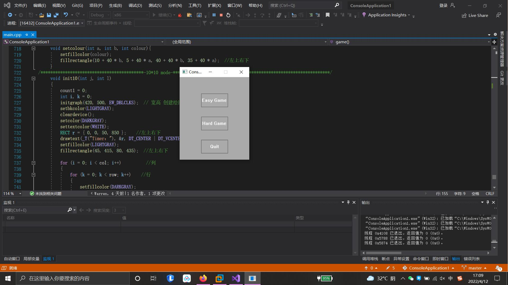
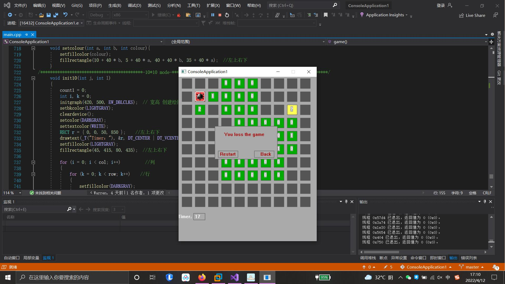
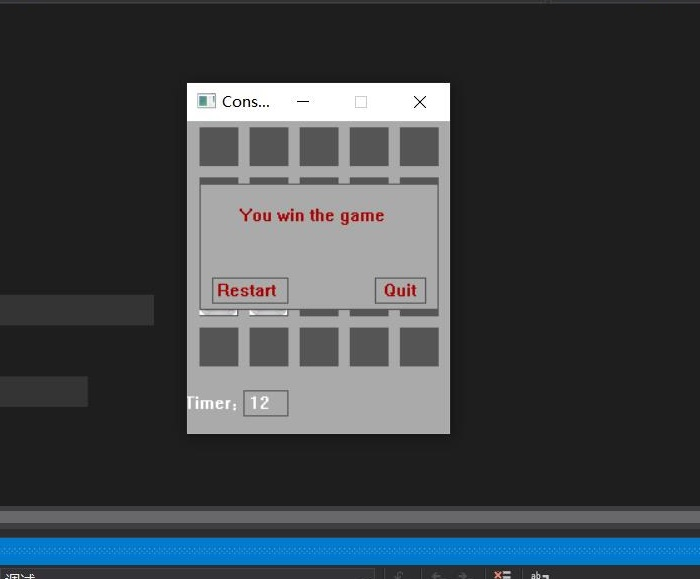

# c-programm -mine sweeping
扫雷小游戏

## 配制环境
* Vs2019 easyx库 Pthread库

## c-programm -mine sweeping实现功能
 * 绘制出扫雷区域-二重循环实现
 * 雷区位置初始化-随机产生1-25的随机数，并定为雷的位置，行 num/5 列 num%5
 * 左键判断-需注意-先选择颜色 再选中填充区域
 * 显示周围雷的数目-有雷为1 无雷为0 定义一个变量记录每个单元块周围八个种雷的数量
 * 右键标记实现-共有三种状态 未点开 标记 疑问 用数组记录 并用数组元素进行状态的比对以实现标记
 * 判断胜利 记录标记的雷的数量，用一个flag变量记录输赢，若点击到雷直接输，最后判断总数减去标记数是否等于雷的数目以判断输赢

 ## 日志
* 4.08
* 1：优化鼠标位置转化二维数组坐标代码函数；
* 2：优化右击改变状态函数；
* 3：优化整体函数结构；
* 4：完成打开空盒子周围八个盒子的操作；
* 5：重新完善失败界面弹窗 -增加了退出和重新开始按钮。

* 4.11
* 1：更新计时器，使用多线程编写，将功能函数封装为一个函数，创建两个线程，一个执行timer，一个封装函数game；
* 2：产生随机数的函数优化；
* 3：优化翻转函数，原来使用的是挨个遍历，重复代码量较大，因此使用了二重循环依次遍历；
* 4：贴图实现；

* 4.12
* 1：编写了启动界面；
* 2：设置两种难度采用条件编译，需在是程序中修改；

* 4.13
* 1:优化两种难度的切换不用条件编译 ，无需在程序中修改，可以直接运行选择难易通过查阅资料发现，
* 如果想通过变量来改变条件编译的内容是不可能，只能用其他文件的宏去改变，因此只能采用更加复杂
* 的方法去实现，即再编写10*10的功能函数去实现，在使用一个变量来控制两种模式的切换。
* 自动打开仍在调试
* 4.14
* 1：递归调试
* 2：判断成功与否的优化
* 4.15
* 1：完成递归打开的调试，为每一个格子设置两个状态，编写一个函数依次遍历周围的格子，若有格子的周围雷数为0则继续执行此函数，
* 递归的退出条件为周围数不为0且格子的状态为flase，否则继续执行。
* 2：发现递归后全局变量ni的值会被覆盖导致数组越界，后采用static变量
## 问题反馈
若有不足 欢迎指正
 

## 项目展示
 * 
 * 
* 
## 关于作者
* warren@伟
* E-mail:warren_wzw@163.com
